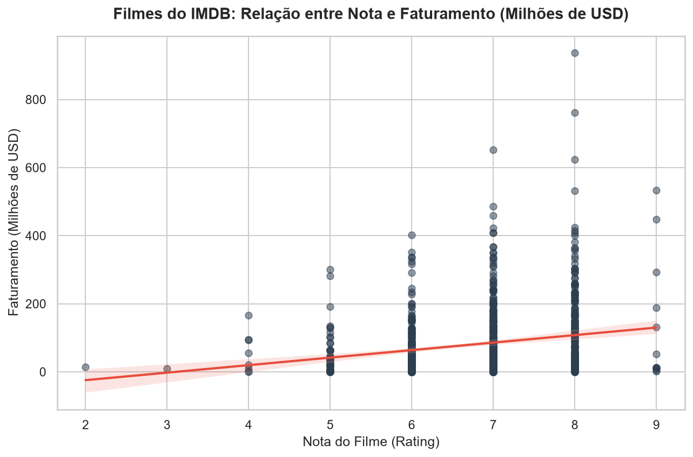
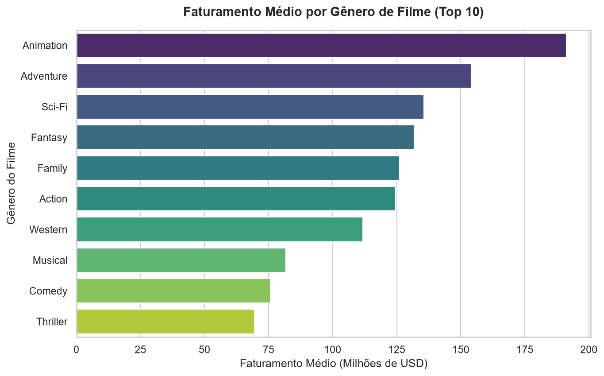

# Desafio de Dados - Looqbox

Olá! Este repositório contém a minha resolução para o Desafio de Dados da Looqbox. Abaixo está a documentação detalhada de cada etapa que realizei, explicada de forma simples e direta.

---

## 🛠️ Ferramentas Utilizadas
* **Banco de Dados (SQL):** MySQL (DBeaver)
* **Linguagem de Programação:** Python 3.13
* **Bibliotecas Python:** Pandas, Matplotlib, Seaborn, MySQL Connector, Python-dotenv
* **Ambiente de Desenvolvimento:** Jupyter Notebook (VS Code)

---

## 1. Resolução das Perguntas em SQL

As consultas SQL foram estruturadas e validadas no banco de dados da Looqbox. Abaixo estão as resoluções com explicações dos pontos corrigidos:

### Questão 1: Quais são os 10 produtos mais caros da empresa?
* **Explicação:** Fiz uma busca na tabela `data_product` ordenando os preços de forma decrescente (do maior para o menor) e pegando apenas as 10 primeiras linhas.
* **Consulta SQL:**
```sql
SELECT 
    dp.PRODUCT_NAME  AS produto,
    dp.PRODUCT_VAL   AS valor,
    dp.DEP_NAME      AS departamento
FROM data_product dp 
ORDER BY dp.PRODUCT_VAL DESC 
LIMIT 10;
```

---

### Questão 2: Quais seções possuem os departamentos 'BEBIDAS' e 'PADARIA'?
* **Explicação:** Ajustei o filtro para buscar pela coluna de departamento (`DEP_NAME`) que de fato agrupa as seções (como vinhos, cervejas, doces, etc), em vez de filtrar por `SECTION_NAME`. Usei `DISTINCT` para listar cada seção uma única vez de forma limpa.
* **Consulta SQL corrigida:**
```sql
SELECT DISTINCT 
    dp.SECTION_COD   AS codigo_secao,
    dp.SECTION_NAME  AS nome_secao
FROM data_product dp 
WHERE dp.DEP_NAME IN ('BEBIDAS', 'PADARIA');
```

---

### Questão 3: Qual foi a venda total de produtos (em $) de cada Área de Negócio no primeiro trimestre de 2019?
* **Explicação:** Juntei as tabelas `data_store_cad` e `data_store_sales` pelo código da loja e filtrei os meses de janeiro a março de 2019.
* **Correção de Ordenação:** Ajustei para ordenar pela soma dos valores numéricos reais (`SUM(dss.SALES_VALUE * dss.SALES_QTY)`), pois a ordenação por `receita` (coluna de texto formatada com `$ `) gerava uma ordenação alfabética incorreta.
* **Consulta SQL corrigida:**
```sql
SELECT 
    dsc.BUSINESS_NAME AS area_negocio,
    CONCAT('$ ', FORMAT(SUM(dss.SALES_VALUE * dss.SALES_QTY), 2)) AS receita
FROM data_store_cad dsc 
INNER JOIN data_store_sales dss ON dss.STORE_CODE = dsc.STORE_CODE 
WHERE YEAR(dss.`DATE`) = 2019
  AND MONTH(dss.`DATE`) BETWEEN 1 AND 3
GROUP BY dsc.BUSINESS_NAME
ORDER BY SUM(dss.SALES_VALUE * dss.SALES_QTY) DESC;
```

---

## 2. Soluções em Python

O código interativo completo está no notebook [script_sqls.ipynb](./cases/main/script_sqls.ipynb).

### 2.1 Função Dinâmica `retrieve_data`
Escrevi uma função chamada `retrieve_data` para buscar dados de vendas de forma simples e flexível na tabela `data_product_sales`. 

* Ela aceita filtros de código de produto (único ou lista), código da loja (único ou lista) e datas (uma data específica ou um intervalo).
* Para garantir a segurança contra vulnerabilidades de *SQL Injection*, a função utiliza **consultas parametrizadas**.

```python
def retrieve_data(conn, product_code=None, store_code=None, date_range=None):
    query = "SELECT STORE_CODE, PRODUCT_CODE, DATE, SALES_VALUE, SALES_QTY FROM data_product_sales WHERE 1=1"
    params = []
    
    if product_code is not None:
        if isinstance(product_code, (list, tuple, set)):
            placeholders = ", ".join(["%s"] * len(product_code))
            query += f" AND PRODUCT_CODE IN ({placeholders})"
            params.extend(product_code)
        else:
            query += " AND PRODUCT_CODE = %s"
            params.append(product_code)
            
    if store_code is not None:
        if isinstance(store_code, (list, tuple, set)):
            placeholders = ", ".join(["%s"] * len(store_code))
            query += f" AND STORE_CODE IN ({placeholders})"
            params.extend(store_code)
        else:
            query += " AND STORE_CODE = %s"
            params.append(store_code)
            
    if date_range is not None:
        if isinstance(date_range, (list, tuple, set)) and len(date_range) == 2:
            query += " AND DATE BETWEEN %s AND %s"
            params.extend(date_range)
        else:
            query += " AND DATE = %s"
            params.append(date_range)
            
    return pd.read_sql(query, conn, params=params)
```

---

### 2.2 Gráficos de Filmes do IMDB

Carregamos os dados de filmes do IMDB e criamos gráficos visuais usando `matplotlib` e `seaborn`.

#### Gráfico 1: Nota do Filme vs. Faturamento
* **Tipo de Gráfico:** Gráfico de Dispersão (Scatter Plot) com linha de tendência.
* **Justificativa:** Excelente para demonstrar a correlação e a dispersão entre duas variáveis numéricas contínuas (nota e faturamento). A linha de regressão auxilia a evidenciar a tendência geral de faturamento maior para filmes mais bem avaliados.
* **Visualização salva em:** `cases/main/imdb_rating_vs_revenue.png`



#### Gráfico 2: Faturamento Médio por Gênero (Top 10)
* **Tipo de Gráfico:** Gráfico de Barras Horizontal.
* **Justificativa:** Desmembramos os múltiplos gêneros listados juntos nos filmes para extrair a média de faturamento real de cada gênero individualmente. O gráfico de barras horizontal é ideal para facilitar a leitura das categorias comparadas.
* **Visualização salva em:** `cases/main/imdb_genre_revenue.png`



---

## 📁 Estrutura do Repositório
```bash
desafio/
├── cases/
│   ├── main/
│   │   ├── imdb_genre_revenue.png      # Gráfico de Gêneros
│   │   ├── imdb_rating_vs_revenue.png  # Gráfico de Notas
│   │   └── script_sqls.ipynb           # Código Python executado
│   └── consultas_bd.sql                # Queries SQL do projeto
├── docs/
│   └── Desafio Looqbox Resolvido.docx  # Relatório completo Word/PDF
├── .gitignore                          # Configuração de arquivos ignorados
└── README.md                           # Esta documentação do projeto
```
